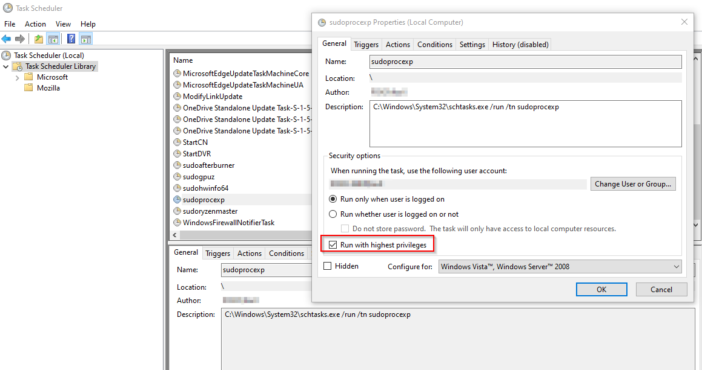

# TaskRun - Task Scheduler tasks

This is a simpler, GUI version of `schtasks.exe`.

## Usage

```powershell
.\TaskRun <task1> <task2> ...
```

Very useful for running programs directly elevated, for example for
Process Explorer:


